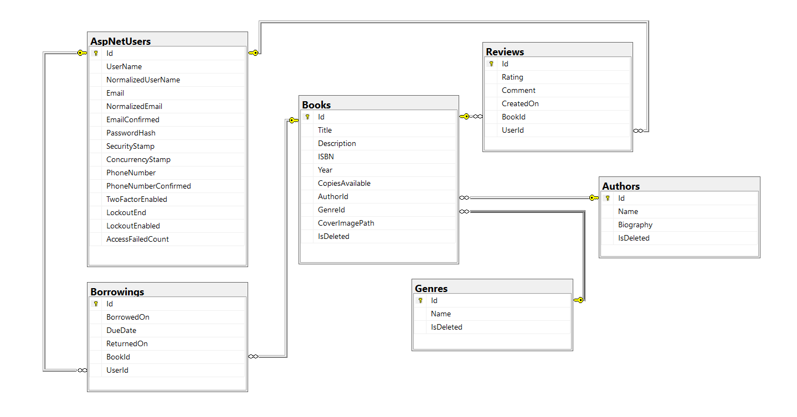

# BigBookLibrary

BigBookLibrary is a virtual library system that allows users to browse books, borrow them, track return dates, and write reviews.
The application includes a full administrative panel for managing books, authors, and genres, as well as user authentication and role-based access.

## Seeded Accounts

The application automatically seeds:

1 administrator account (created in RoleSeeder.cs)
2 regular user accounts (created in UserSeeder.cs)

These accounts are generated on first run.
Their email addresses and passwords can be found directly in the corresponding seeder files:

- Data/Seeding/RoleSeeder.cs – administrator credentials  
- Data/Seeding/UserSeeder.cs – regular user credentials

You can also register additional accounts through the UI.

## Features

- Browse all available books  
- Borrow books and track borrow/return dates  
- Write and view reviews for each book  
- Search functionality for books  
- Seeded data for books, authors, and genres  
- Soft delete support  
- Admin panel (`/Admin` area) for:
  - Creating, editing, deleting and viewing books  
  - Managing authors and genres  
- Authentication and authorization using ASP.NET Core Identity  
- User roles: **User** and **Admin**  
- Service layer architecture  
- Automatic EF Core migrations  

## Architecture & Principles

The project follows clean architecture practices and applies the **SOLID principles** through a service-layer structure, separation of concerns, and clear responsibility distribution across the application.

## Technologies Used

- **ASP.NET Core MVC (.NET 8)**  
- **Entity Framework Core**  
- **SQL Server**  
- **ASP.NET Core Identity**  
- **Bootstrap 5**  
- **C#**  
- **LINQ**  
- **Visual Studio**  
- **SQL Server Management Studio (SSMS)**

## Entity Models

The project uses a total of **6 entity models**, which meets the assignment requirement.  
Five of them are created by me, and the sixth one comes from ASP.NET Core Identity (`AspNetUsers`), which is used for authentication.

Here is a screenshot of the database diagram showing all 6 tables:

## Setup Instructions

1. Clone the repository from GitHub  
2. Open the solution in **Visual Studio**  
3. Ensure SQL Server is running  
4. No connection string changes are required (universal configuration included)  
5. Run the project — the database will be created and seeded automatically

## Admin Login

Use the following credentials to access the Admin panel:

**Email:** admin@bigbooklibrary.com  
**Password:** Admin123!

